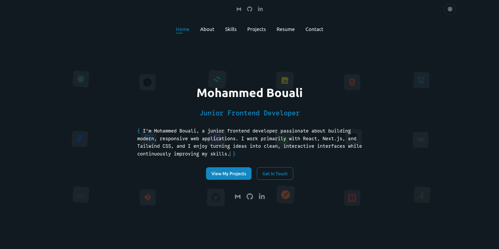

# Portfolio

A personal portfolio website built to showcase my projects, skills, resume, and contact information.

**Live Demo:** https://mohammedbouali.vercel.app/

## Tech Stack

- React
- React Router
- Vite
- Tailwind CSS
- JavaScript
- Framer Motion
- EmailJS

## Features

- Responsive multi-page portfolio (Home, About, Skills, Projects, Resume, and Contact pages)
- Light / dark mode
- Animated UI interactions
- Contact form powered by EmailJS

## Project Structure

```bash
src
├── app
├── assets
├── components
├── constants
├── features
├── hooks
├── lib
├── pages
└── setupTests.js
```

## Getting Started

### Prerequisites

- Node.js
- npm

### Installation

```bash
npm install
```

### Start the development server

```bash
npm run dev
```

## Screenshot

